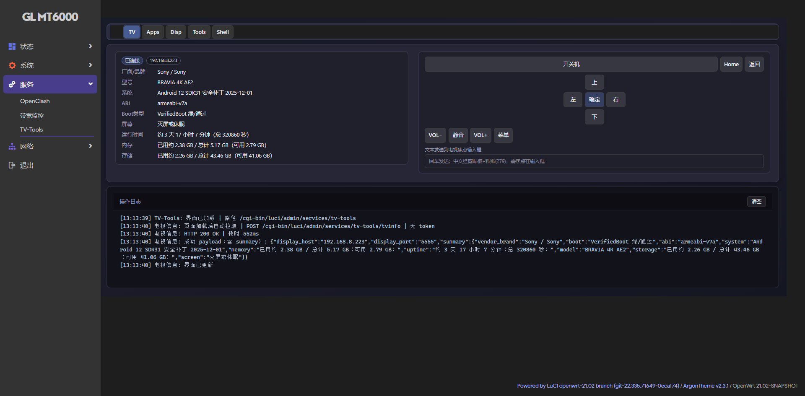
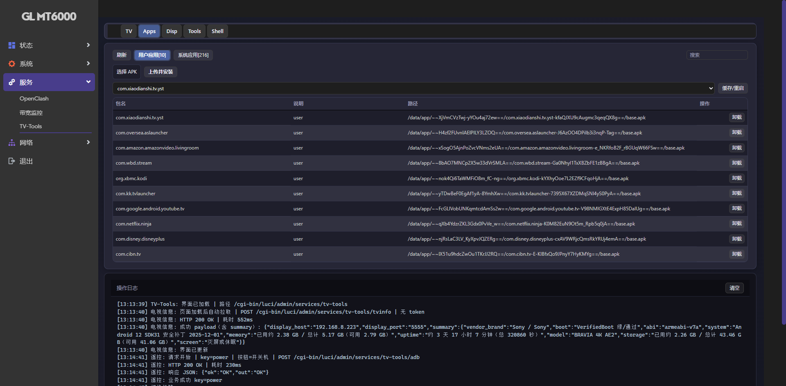
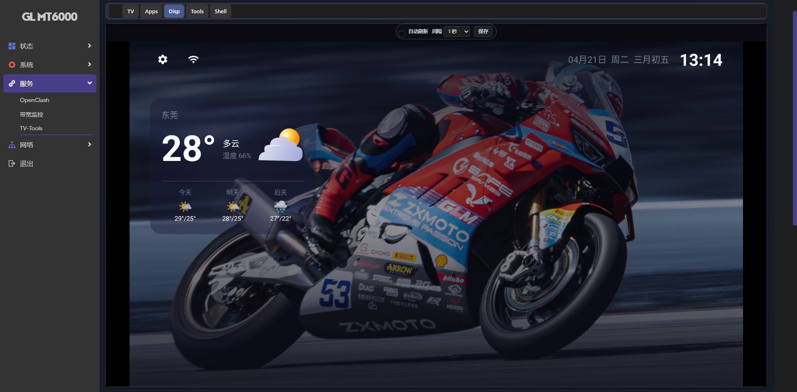
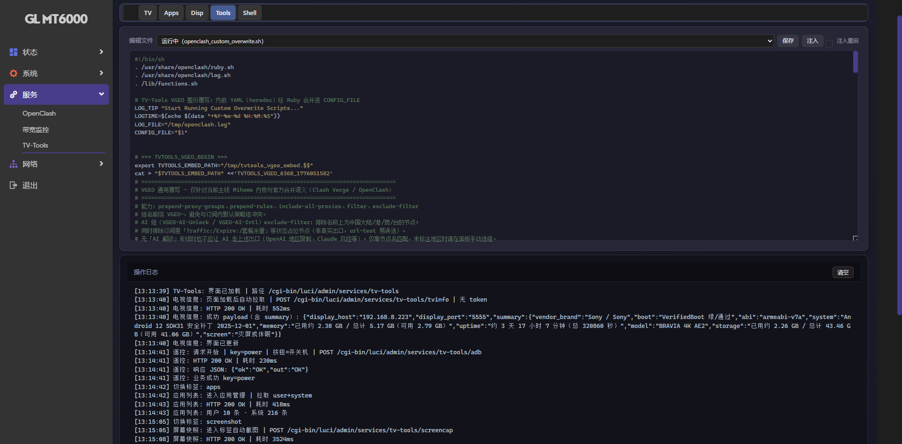
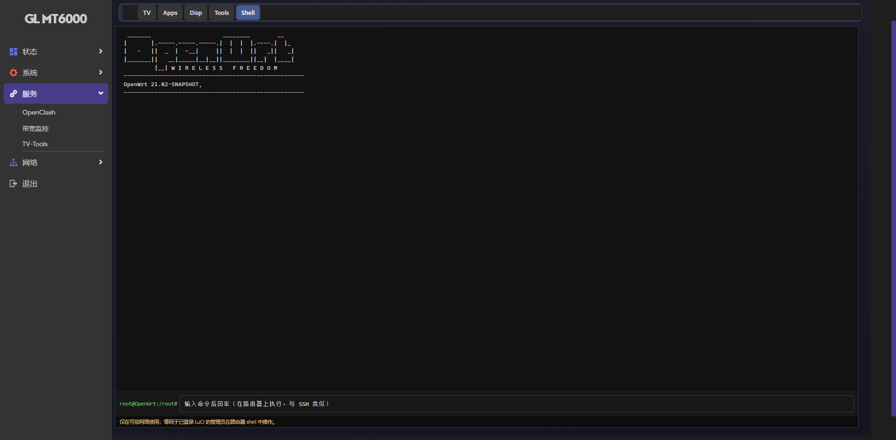

# luci-app-tv-tools

OpenWrt LuCI 插件：通过 ADB 控制 Android TV（遥控按键、文本输入、应用管理、截图预览、Syshell）。

## 功能概览

- 电视遥控：电源、方向、确认、返回、音量、菜单等常用按键
- 文本输入：将网页输入框内容发送到电视当前焦点输入框
- 应用管理：用户/系统应用列表、APK 安装、卸载、缓存/重启
- 屏幕快照：手动截图 + 预览，支持按间隔自动刷新
- Syshell：在 LuCI 页面内执行路由器本机 shell（管理员态）

## 界面预览

### TV — 遥控 & 设备信息

获取电视设备详情（品牌/型号/系统/ADB/内存/存储），提供方向键、确认、返回、Home、音量、静音等遥控按键，以及文本输入框。



### Apps — 应用管理

列出电视上的用户应用与系统应用，支持一键卸载、安装本地 APK（上传并安装）。



### Disp — 屏幕截图预览

在 LuCI 页面内实时查看电视屏幕截图，支持自动刷新间隔设置与手动截图。



### Tools — 文件编辑器

内置编辑器，可在路由器本地直接查看并编辑 OpenClash 覆写脚本等配置文件，支持保存与注入操作。



### Shell — 路由器终端

在 LuCI 页面内以 root 权限执行路由器本机 shell 命令，等同于 SSH 访问，仅限可信内网使用。



## 项目结构

- `luci-app-tv-tools/luasrc/controller/tv_tools.lua`：后端路由与业务逻辑
- `luci-app-tv-tools/luasrc/view/tv_tools/main.htm`：LuCI 页面模板
- `luci-app-tv-tools/htdocs/luci-static/tv-tools/`：前端 JS/CSS 资源
- `luci-app-tv-tools/root/usr/bin/`：ADB 辅助脚本
- `scripts/deploy-tv-tools.ps1`：Windows 一键部署脚本

## 环境要求

- 路由器：OpenWrt / LuCI
- 路由器已安装 `adb`（可执行 `adb version`）
- 电视已开启 ADB（网络调试），路由器到电视网络可达

## UCI 配置

当前配置统一使用 `tv_tools.main.*`：

```sh
uci set tv_tools.main=tv
uci set tv_tools.main.host='192.168.8.223'
uci set tv_tools.main.port='5555'
uci set tv_tools.main.cap_auto_refresh='1'
uci set tv_tools.main.cap_interval_ms='2000'
uci commit tv_tools
```

查看配置：

```sh
uci show tv_tools
```

## 部署

### 方式 1：Windows 脚本（推荐）

```powershell
.\scripts\deploy-tv-tools.ps1 -RouterIp <ROUTER_IP>
```

脚本会：

- 上传 LuCI 页面/控制器/静态资源/脚本
- 规范为 UTF-8（无 BOM）+ LF
- 重建 LuCI 缓存并重启 `uhttpd`

### 方式 2：手动部署

按目录将文件同步到路由器对应路径，并执行：

```sh
chmod 755 /usr/bin/tv-tools-*.sh
rm -rf /tmp/luci-modulecache /tmp/luci-indexcache /tmp/luci-sessions
/etc/init.d/uhttpd restart
```

## 卸载（彻底清理）

路由器上可执行：

```sh
sh /usr/bin/tv-tools-uninstall.sh
```

清理内容包括插件文件、UCI 配置、缓存及 TV-Tools 生成的 OpenClash 临时/模板文件。
注意：脚本不会删除你已经注入到 `openclash_custom_overwrite.sh` 的有效覆写内容。

## 常用运维命令

检查 Web 服务：

```sh
/etc/init.d/uhttpd status
netstat -lntp | grep -E ':80|:8080|uhttpd' || ss -lntp | grep -E ':80|:8080|uhttpd'
```

重启 LuCI 相关服务：

```sh
/etc/init.d/rpcd restart
/etc/init.d/uhttpd restart
```

## 故障排查

### 1) LuCI 打不开（`ERR_CONNECTION_REFUSED`）

```sh
/etc/init.d/uhttpd restart
uci -q delete uhttpd.main.listen_http
uci add_list uhttpd.main.listen_http='0.0.0.0:80'
uci add_list uhttpd.main.listen_http='0.0.0.0:8080'
uci commit uhttpd
/etc/init.d/uhttpd restart
```

### 2) 服务菜单有残留空项（旧 tvcontrol）

```sh
rm -f /usr/lib/lua/luci/controller/tvcontrol.lua /usr/lib/lua/luci/controller/luci-app-tvcontrol.lua
rm -rf /usr/lib/lua/luci/view/tvcontrol /www/luci-static/tvcontrol /www/luci-static/resources/view/tvcontrol /www/luci-static/resources/tvcontrol
rm -f /usr/share/luci/menu.d/*tvcontrol*.json /usr/share/luci/menu.d/*sony*.json
rm -f /usr/share/rpcd/acl.d/*tvcontrol*.json /usr/share/rpcd/acl.d/*sony*.json
rm -rf /tmp/luci-modulecache /tmp/luci-indexcache /tmp/luci-sessions
/etc/init.d/rpcd restart
/etc/init.d/uhttpd restart
```

### 3) 文本输入成功但电视无变化

- 先确认电视焦点在可输入框
- 确认 ADB 状态为 `device`
- 对中文输入，受不同电视 ROM/输入法限制，行为可能不同

## 安全提示

- `Syshell` 等同管理员在路由器执行 shell，请仅在可信网络使用
- 建议仅开放内网访问 LuCI，避免公网暴露

